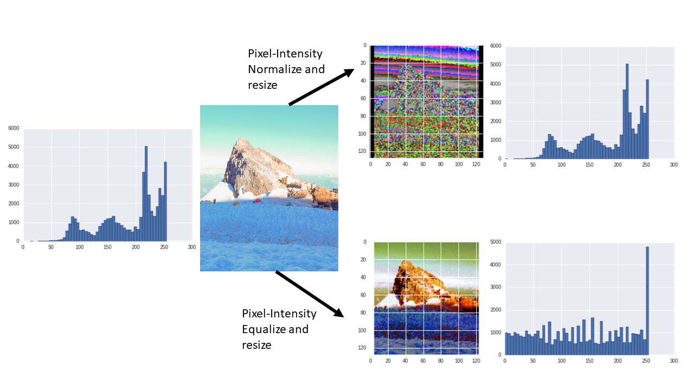

# Challenge 2 - The Data in Data Science

## Background
Challenge 1 introduced an intuitive, easy-to-use system for creating and calling a Machine Learning model. But before the images can be used to train a custom model, the image data needs preprocessing to make the images consistent and comparable.

Challenge 2 will set the team up for success by creating a good quality dataset to use when building custom Machine Learning models later on. The Data Science team at AdventureWorks, with whom your team is working, can only move forward on this project when the data has been appropriately processed.

The gear product catalog images AdventureWorks has provided are currently raw, unformatted pixel data. Before the images can be used to train a custom model, the data needs to be preprocessed to create new pixel data in a normalized, clean format, so that images are comparable within the dataset.

Data processing is an often overlooked, but critical, piece of building high performing Machine Learning models. A Machine Learning model will almost always perform poorly without data that is clean and appropriately preprocessed.

Image data is essentially pixel data. However, simply dealing with pixel data is not usually what we want to do in image analysis. Some possible preprocessing steps are: contrast enhancement, rotation, translation, and feature extraction through various transformations.

Much time and thought generally goes into these crucial steps and the steps will be different depending on the data you are using and the exact problem the model should solve. Images may have glare, saturation differences, exposure differences, contrast issues, all that could make one set of pixels not comparable to the next.

## Prerequisites
Team has a setup for sharing code and working in Jupyter
The Gear catalog dataset (same as used in Challenge 1)
Challenge
Use the team setup and expertise to do the following tasks.

The team will transform all the classes of the gear images into a particular format that can be used later on: 128x128x3 pixels (this means a 3-channel, 128x128 pixel square image - but please refrain from simply stretching the images).

Read more about the concepts and challenge in the References.

Perform the following:

Pick a basic color, e.g. white, and pad all images that do not have 1:1 aspect ratio
Reshape, without stretching, to a `128x128x3` pixel array shape
Ensure for each image that the pixel range is from 0 to 255 (inclusive or [0, 255]) which is also called “contrast stretching”.
Note: only one method is required
Save the data to disk in a format the team deems appropriate for easily reading back in (see Hints).
Take into account when saving the data that it will be used for Classification.
Consider that numpy arrays are the common currency in Machine Learning frameworks
Shown below are two ways of pixel-value stretching to be in the [0,255] range, or 0-255 inclusive (plotted with matplotlib):

*Normalized or equalized image*

Normalized or equalized image
Normalize or equalize to ensure that the pixels are in a range from [0,255].

## Success Criteria
- The team will run one code cell in a Jupyter notebook for the coach plotting the original image and then plotting the padded and pixel-value normalized or equalized image.
- The team will run one code cell in a Jupyter notebook for the coach that shows the histogram of the pixel values which should be in the range of 0 to 255, inclusive ([0, 255]).

## References
### Read me first

- Is your data ready for data science? [Doc](https://docs.microsoft.com/azure/machine-learning/studio/data-science-for-beginners-is-your-data-ready-for-data-science?wt.mc_id=OH-ML-ComputerVision)
- `jupyter` [Ref](https://jupyter.readthedocs.io/en/latest/running.html)
- On using `conda` or `pip` to install Python packages [Ref](https://conda.io/docs/user-guide/tasks/manage-pkgs.html)

### Useful Packages

- `matplotlib` on dealing with images (I/O, plotting) [Ref](https://matplotlib.org/2.0.2/users/image_tutorial.html)
- `numpy` for image manipulation/processing/visualization [Ref](http://www.scipy-lectures.org/advanced/image_processing/)
- `PIL` Image module for I/O and more [Ref](http://pillow.readthedocs.io/en/4.2.x/reference/Image.html)
- `PIL` ImageOps module which has the ability to flip, rotate, equalize and perform other operations. [Ref](http://pillow.readthedocs.io/en/4.2.x/reference/ImageOps.html)

### Concepts

Feature scaling (normalization) [Ref](https://en.wikipedia.org/wiki/Feature_scaling)

### Code samples

Pixel intensity normalization example [Ref](https://stackoverflow.com/questions/7422204/intensity-normalization-of-image-using-pythonpil-speed-issues)

### Hints
- It might be a good idea to encapsulate the image preprocessing into a function.
- The `numpy` package is great for image manipulation
- The `numpy` package can be used for I/O as well ([Ref](https://docs.scipy.org/doc/numpy-1.13.0/reference/routines.io.html)) - quicker than `pandas` I/O
- Some ways to “strech” the pixel range of an image include: pixel-intensity normalizing or equalizing the image histogram. Explore stackoverflow and PIL for some ideas.
- In `matplotlib` a pixel value of 0 for all channels appears black, 1 appears white, and 255 appears black.
- In `opencv` images are read in a BGR whereas `matplotlib` reads and expects images as RGB. Conversion information can be found [here](https://www.scivision.co/numpy-image-bgr-to-rgb/)