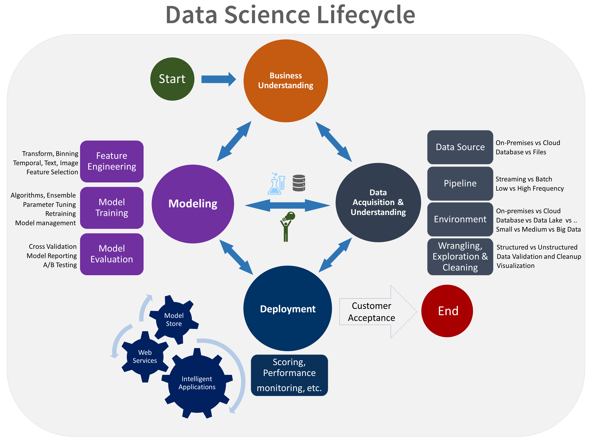

# Challenge 5 - Deploy to the Cloud
## Background
It’s not just enough to be able to build a world class machine learning model, you need to know how to expose it so that it can be consumed by team members, developers, and 3rd parties to provide useful functionality to applications and services for AdventureWorks customers.

In this challenge you will operationalize your model as a scoring REST API in the cloud (deploy it as a webservice), so that the developers at AdventureWorks and elsewhere can then write consumer applications and use this scoring endpoint for prediction.

In this helpful diagram, the deployment phase is shown prominently as part of the Data Science lifecycle.

Data Science Lifecycle

## Prerequisites
- Docker engine (Docker for Windows or Docker for Mac) installed and running locally or on a VM
- Azure CLI and Azure ML CLI (`azure-cli` and `azure-cli-ml` packages)
- Tooling such as the `curl` command line tool or [Postman](https://www.getpostman.com/) to send a request to your model endpoint
- Saved model from **Challenge 3**

## Challenge
Use the team setup and team expertise to do the following tasks.

- Deploy the team’s saved model from Challenge 3 or Challenge 4 as a real-time web service on Azure.
Use one of the following tools to deploy the model as and API to which data may be sent (e.g. arrays or json) and a json response received - see References for useful links.

- Azure Machine Learning CLI standalone
- Azure Machine Learning Workbench
- Non-CLI methods, e.g. Flask with Docker (see a suggestion, below)

It’d be best for AdventureWorks to have a fairly simple API, so a json-serialized image would work well.

## Success Criteria
Demonstrate with `curl` or Postman that sending an image, via a URL or serialized, to your cloud deployed web service returns the model output - the class of gear
## References
### Read Me First 
- Overview of Azure ML model management [Doc](https://docs.microsoft.com/azure/machine-learning/preview/model-management-overview?wt.mc_id=OH-ML-ComputerVision) 
- Deployment walkthrough [Ref](https://michhar.github.io/deploy-with-azureml-cli-boldly/)

### More on Deployment 
- Microsoft Blog on deploying from Azure ML Workbench and the Azure ML CLI [Ref](https://blogs.technet.microsoft.com/machinelearning/2017/09/25/deploying-machine-learning-models-using-azure-machine-learning/) 
- Setting up with the Azure ML CLI for deployment [Doc](https://docs.microsoft.com/azure/machine-learning/preview/deployment-setup-configuration?wt.mc_id=OH-ML-ComputerVision) 
- Non-CLI deployment methods (AML alternative) [Ref](https://github.com/Azure/ACS-Deployment-Tutorial)

### Scoring File and Schema Creation References 
- Example of schema generation [Doc](https://docs.microsoft.com/azure/machine-learning/preview/model-management-service-deploy?wt.mc_id=OH-ML-ComputerVision#2-create-a-schemajson-file) 
- Example of the scoring file showing a CNTK model and serializing an image as a `PANDAS` data type for input data to service [Ref](https://github.com/Azure/MachineLearningSamples-ImageClassificationUsingCntk/blob/master/scripts/deploymain.py) 
- Example of the scoring file showing a `scikit-learn` model and a `STANDARD` data type (json) for input data to service [Ref](https://github.com/Azure/Machine-Learning-Operationalization/blob/master/samples/python/code/newsgroup/score.py) 
- After creating a `run` and `init` methods as in the links above, plus a schema file, begin with “Register a model” found in this [Doc](https://docs.microsoft.com/azure/machine-learning/preview/model-management-service-deploy?wt.mc_id=OH-ML-ComputerVision#4-register-a-model) 
- Note one change required: there must be, if using certain frameworks, a `pip` requirements file (use `-p` flag) when creating the manifest

### Docker

Docker Docs [Ref](https://docs.docker.com/get-started/)

### Hints
- There are different input data type options for sending up to the service and you can specify this when you generate the schema for the service call.
- The team must install the Azure ML CLI into the system Python if using a DSVM and the main Python in a local setup with (from this [Doc](https://docs.microsoft.com/azure/machine-learning/preview/deployment-setup-configuration?wt.mc_id=OH-ML-ComputerVision#using-the-cli)): `! sudo pip install -r https://aka.ms/az-ml-o16n-cli-requirements-file`
- When creating the image with the `az ml` cli, remember to include all files necessary with the `-d` flag such as the conda_dep.yml or any label files. Avoid using the `-c` flag for the `conda_dep.yml` file, using `-d` instead. Also, a `requirements.txt` file, with the pip installable packages, should be specified with the `-p` flag.
- Cluster deployment: Refer to the rest of this [Doc](https://docs.microsoft.com/azure/machine-learning/preview/deployment-setup-configuration?wt.mc_id=OH-ML-ComputerVision#environment-setup)
